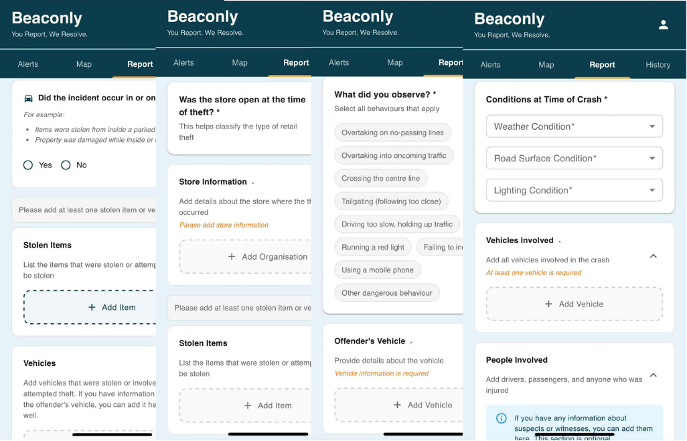
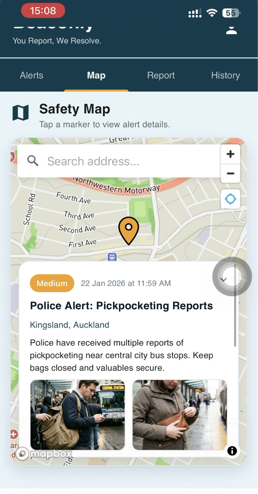
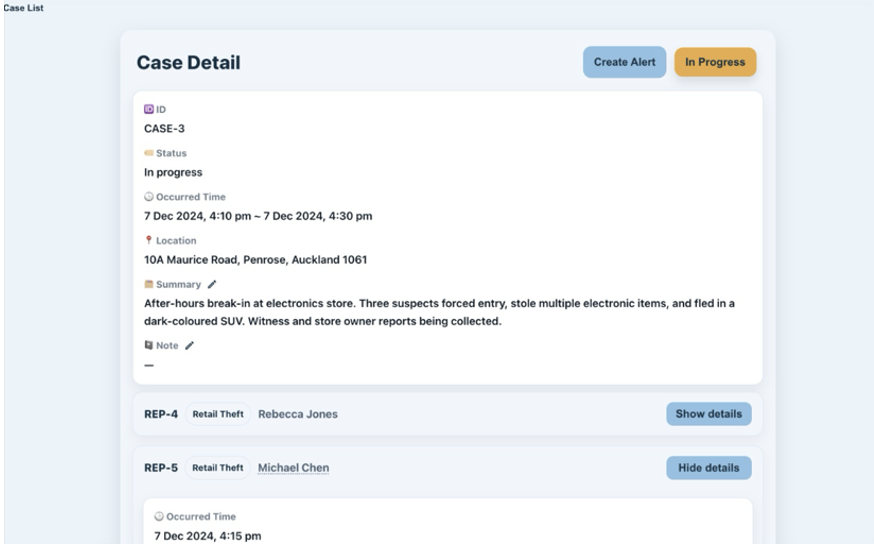
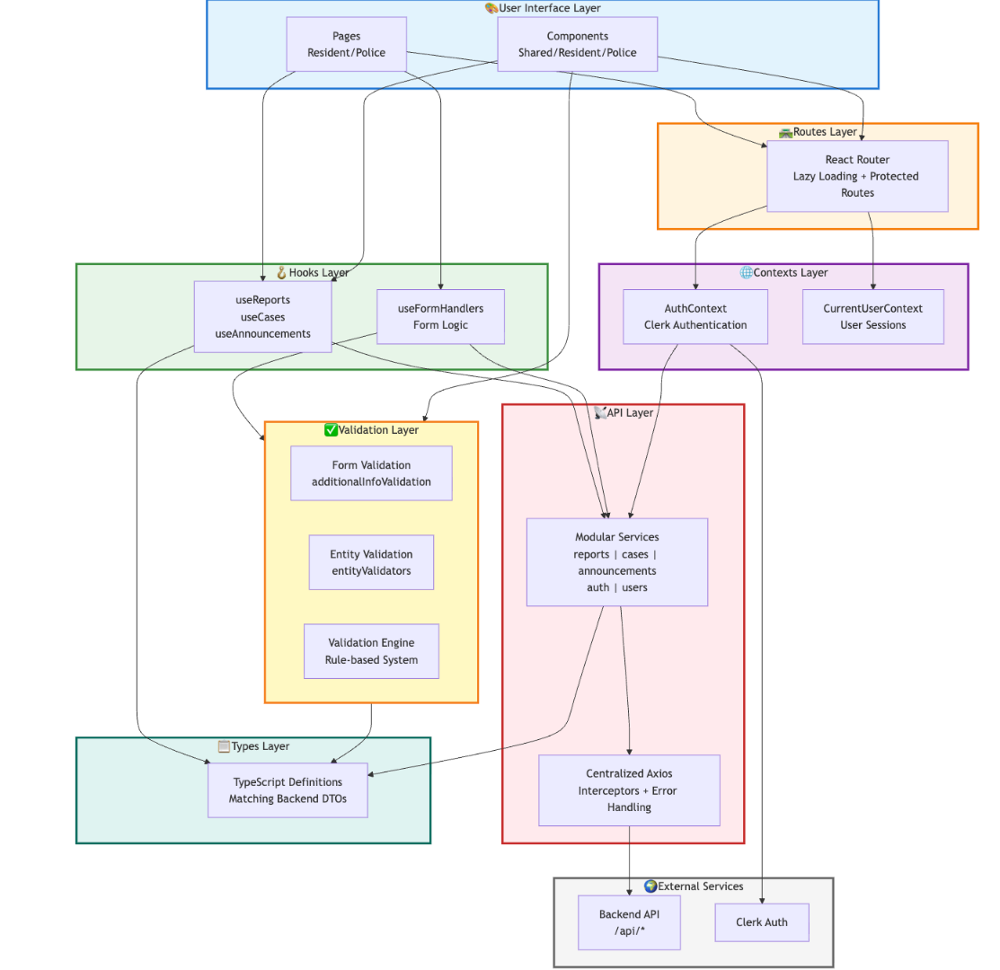
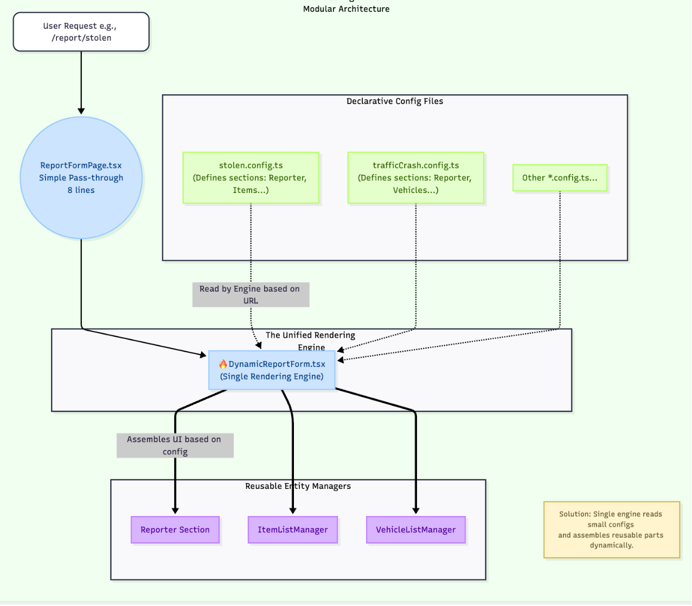
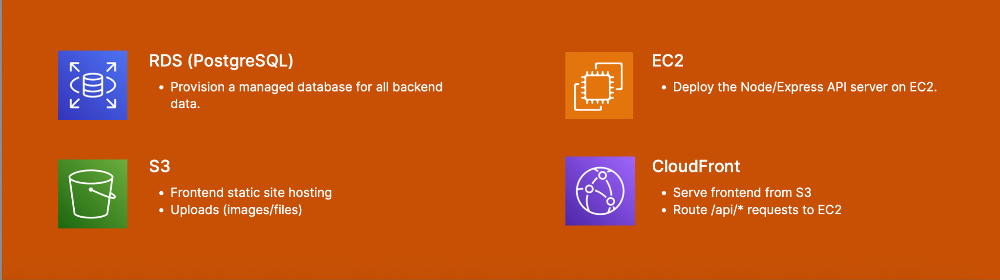

# Beaconly — Community Safety Platform

> **Project showcase / case study**  
> The original source repository is private due to university project access restrictions.  
> This repository presents selected non-confidential visuals, architecture, technical decisions,
> and my individual contributions.

## Overview

**Beaconly** is an AI-assisted, full-stack community-safety platform designed to improve communication between
residents and law-enforcement users. Residents can submit and track safety reports, view public
alerts, and use a map to explore relevant incidents. Police/staff users can review reports,
manage cases, publish alerts, and update investigation progress.

This was a **team project**. The material here focuses on the areas I personally worked on or
helped shape, especially frontend architecture, authentication/profile flows, dynamic report
forms, validation design, maintainability, and frontend/backend integration.

### AI-Assisted Features

AI supports both resident reporting and police workflows:

- **Report classification** — helps residents choose an appropriate category for their report.
- **Auto-fill** — helps residents complete report fields with less manual data entry.
- **Case summaries** — helps police officers review case information through AI-generated summaries.

## Product Snapshot

### Dynamic report forms

The reporting flow adapts to different incident types rather than forcing every category into a
single rigid form.



Additional category views are available in:
- [`dynamic-report-forms-labelled.png`](assets/screenshots/dynamic-report-forms-labelled.png)
- [`report-category-gallery.png`](assets/screenshots/report-category-gallery.png)

### Safety map

Residents can view safety alerts spatially and inspect alert details from the map.



### Police case management

Staff can work with case details, linked reports, status and follow-up actions.



> The case screenshot is from a project/demo environment. Visible names, addresses and report
> details are synthetic or approved for public disclosure.

## Tech Stack

**Frontend**
- React
- TypeScript
- Vite
- Material UI
- Mapbox

**Backend / Data**
- Node.js
- Express
- TSOA
- Prisma
- PostgreSQL

**Auth / AI / Tooling**
- Clerk
- AWS Bedrock
- Docker
- GitHub
- Swagger
- Vitest
- Supertest

**Deployment**
- Amazon S3
- Amazon CloudFront
- Amazon EC2
- Amazon RDS (PostgreSQL)

## Frontend Architecture

The frontend is organised into seven layers:

1. **UI layer** — pages and reusable components
2. **Routes layer** — React Router, lazy loading and protected role-based routes
3. **Contexts layer** — global authentication/session state
4. **Hooks layer** — reusable data-fetching and form/state logic
5. **API layer** — modular services over a central Axios client with interceptors
6. **Types layer** — TypeScript definitions aligned with backend DTOs
7. **Validation layer** — reusable form/entity rules and a rule-based executor



This structure was intended to strengthen **separation of concerns, type safety, code reuse,
maintainability and performance**.

More detail: [`docs/frontend-architecture.md`](docs/frontend-architecture.md)

## Key Technical Decision: Configuration-Driven Report Forms

A major frontend challenge was supporting a growing number of report categories with different
fields, entity combinations and validation rules.

A straightforward hardcoded approach worked initially, but it scaled poorly: small differences
were duplicated across multiple components, increasing maintenance cost and bug risk.

The design therefore moved toward a **configuration-driven reporting architecture**:

- category-specific declarative config files
- a unified rendering engine
- reusable entity managers
- reusable validation rules
- rule execution outside page components



The goal was to make a new category or rule change primarily an **extension of configuration or
rules**, rather than a rewrite of several components.

More detail: [`docs/technical-decisions.md`](docs/technical-decisions.md)

## My Contributions

My main contribution areas included:

- Designing and documenting the frontend architecture
- Working on authentication and profile flows
- Improving separation of concerns between UI, state, API and validation
- Moving report forms from duplicated hardcoded flows toward a configuration-driven structure
- Contributing to a rule-based validation architecture
- Debugging user-facing issues by tracing them to root causes
- Reviewing changes with attention to secure, minimal and maintainable implementation
- Integrating frontend models and API flows with backend DTOs/services

More detail: [`docs/my-contributions.md`](docs/my-contributions.md)

## AWS Deployment Architecture

The project architecture separated static delivery, application logic and persistence:

- **CloudFront** as the public entry point
- **S3** for static frontend hosting and uploaded assets
- **EC2** for the Node/Express API
- **RDS (PostgreSQL)** for backend data



## Evaluation

The project included structured usability testing with students and staff. Participants followed
the same task instructions and completed a survey afterwards.

Reported outcomes included:

- report submission was easy to use
- the UI was easy to navigate
- report-submission time was reduced by **over 65%**

## Lessons Learned

- Dynamic design matters early when business-rule combinations grow.
- Entity relationships should be clarified before implementation.
- Frontend work improves when backend controller/service/data-access boundaries are understood.
- Existing services such as Clerk, Material UI, Mapbox and AWS can reduce unnecessary reinvention.
- User testing should inform design rather than merely validate it at the end.
- AI coding tools can accelerate implementation, but developers still need a complete mental model,
  precise requirements, and the ability to evaluate generated changes.

## Repository Structure

```text
beaconly-project-showcase/
├── README.md
├── NOTICE.md
├── docs/
│   ├── project-overview.md
│   ├── frontend-architecture.md
│   ├── my-contributions.md
│   ├── technical-decisions.md
│   └── lessons-learned.md
└── assets/
    ├── diagrams/
    │   ├── frontend-architecture.png
    │   ├── dynamic-report-architecture.png
    │   └── aws-deployment.png
    └── screenshots/
        ├── dynamic-report-forms.png
        ├── dynamic-report-forms-labelled.png
        ├── report-category-gallery.png
        ├── safety-map.png
        └── case-detail-demo.png
```

## Source-Code Note

The original project repository is private. This showcase deliberately does **not** reproduce
restricted source code, other team members' private work, credentials, or internal project data.

I can walk through the architecture, technical decisions, development process and my individual
contributions in an interview.
